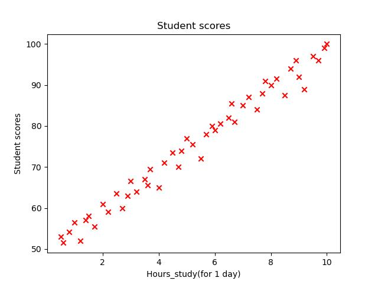
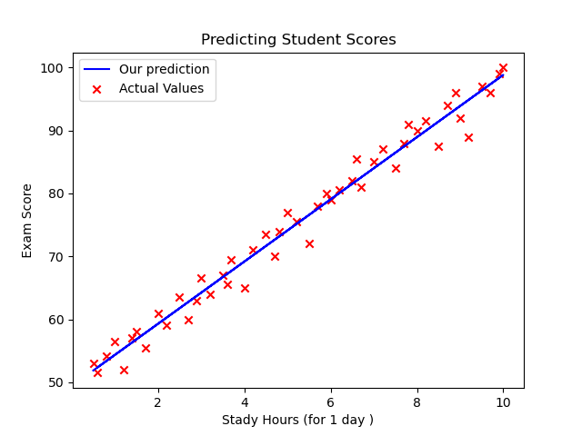
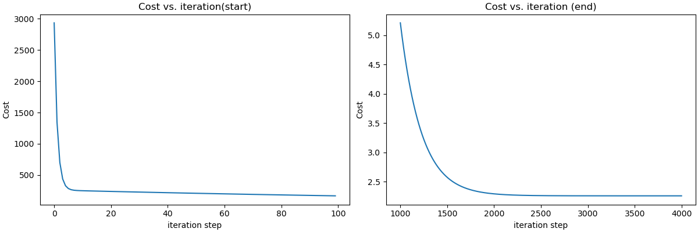

# 🎓 Predicting Student Scores — Linear Regression from Scratch

A simple yet complete implementation of **Linear Regression from scratch** using Python and NumPy — no scikit-learn, no shortcuts. The model predicts a student's exam score based on their daily study hours.

---

## 📌 Problem Statement

> Given the number of hours a student studies per day, predict their exam score.

This is a **supervised regression** problem. The model learns a linear function:

```
ŷ = w · x + b
```

Where:
- `x` → study hours per day
- `ŷ` → predicted exam score
- `w` → weight (slope)
- `b` → bias (intercept)

---

## 📁 Project Structure

```
Predicting_student_Scores/
│
├── model_screenshot/
│   ├── cost_function.png  # Output: cost convergence plots
│   ├── data.jpg           # Output: raw data visualization
│   └── prediction.png     # Output: regression line plot
│
├── __pycache__/           # Python bytecode cache (auto-generated)
├── model.py               # Core ML functions (prediction, cost, gradient descent)
├── train.py               # Training script, plots, and results
├── student_scores.csv     # Dataset (Hours_Study, Score)
├── requirements.txt       # Python dependencies
└── README.md
```

---

## 🧠 How It Works

### 1. `model.py` — The Engine

| Function | Description |
|---|---|
| `compute_model_output(x, w, b)` | Computes predictions `ŷ = w·x + b` |
| `cost_function(f_x, y, x)` | Computes MSE cost `J(w,b)` |
| `compute_gradient(f_x, y, x)` | Computes partial derivatives `∂J/∂w` and `∂J/∂b` |
| `gradient_descent(...)` | Iteratively updates `w` and `b` to minimize cost |

### 2. Cost Function (MSE)

$$J(w,b) = \frac{1}{2m} \sum_{i=0}^{m-1} (\hat{y}_i - y_i)^2$$

### 3. Gradient Descent Update Rule

```
w = w - α · (∂J/∂w)
b = b - α · (∂J/∂b)
```

---

## 📊 Dataset

File: `student_scores.csv`

| Column | Description |
|---|---|
| `Hours_Study` | Number of study hours per day |
| `Score` | Exam score (target variable) |

Example:

```
Hours_Study,Score
1.5,37
3.0,55
5.0,71
7.5,88
9.0,95
```



---

## ⚙️ Hyperparameters

| Parameter | Value |
|---|---|
| Learning rate `α` | `0.01` |
| Iterations | `4000` |
| Initial `w` | `0` |
| Initial `b` | `0` |

---

## 🚀 Getting Started

### 1. Clone the repository

```bash
git clone https://github.com/your-username/Predicting_student_Scores.git
cd Predicting_student_Scores
```

### 2. Install dependencies

```bash
pip install -r requirements.txt
```

### 3. Run the training

```bash
python train.py
```

---

## 📈 Output

### Regression Line



### Cost Convergence



### Terminal Output

```
Iteration    0: Cost 1.56e+03  dj_dw:  -5.832e+02, dj_db: -8.500e+01   w:  5.832e+00, b: 8.50000e-01
Iteration  400: Cost 2.14e+01  dj_dw:  -1.203e-01, dj_db:  2.011e-02   w:  8.712e+00, b: 7.14500e+00
...
(w,b) found by gradient descent: (  9.1234,  5.8821)
```


---

## 🔬 Implementation Details

### `compute_model_output`
Iterates over all samples to compute `ŷᵢ = w·xᵢ + b` and returns the full prediction array.

### `compute_gradient`
Computes the gradient of the cost function:

```
∂J/∂w = (1/m) · Σ (ŷᵢ - yᵢ) · xᵢ
∂J/∂b = (1/m) · Σ (ŷᵢ - yᵢ)
```

### `gradient_descent`
- Uses `copy.deepcopy` to avoid mutating the initial weight
- Logs cost & parameter history every `ceil(num_iters/10)` steps
- Stores history only when `num_iters < 10000` to save memory

---

## 📉 Limitations

- Single feature only (`Hours_Study`)
- No train/test split — model is evaluated on training data
- No feature normalization (may slow convergence on different scales)
- No regularization (L1/L2)

---

## 🛠️ Possible Improvements

- [ ] Add train/test split and evaluation metrics (MAE, R²)
- [ ] Normalize features for faster convergence
- [ ] Extend to Multiple Linear Regression
- [ ] Add residuals analysis plot
- [ ] Visualize gradient descent trajectory on cost contour

---

## 👤 Author

**Amine**  
Machine Learning — Linear Regression from Scratch  
Feel free to ⭐ the repo if you found it useful!
